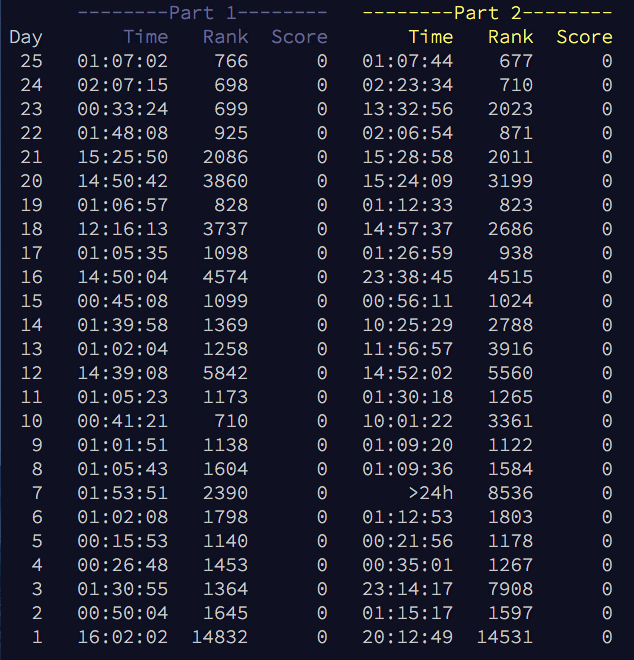

# Advent of Code 2017

This repository contains my solutions to the [Advent of Code 2017](http://adventofcode.com) challenges by [Eric Wastl](https://github.com/topaz).

Writing these solutions have significantly aided my efforts to learn C++ and have often forced me to "look ahead" in my study to more advanced language facilities.

### Final Stats:

I was able to complete the challenges with my limited C++ knowledge. After I complete my introductory text-book I'd like to come back and attempt more effective solutions.
