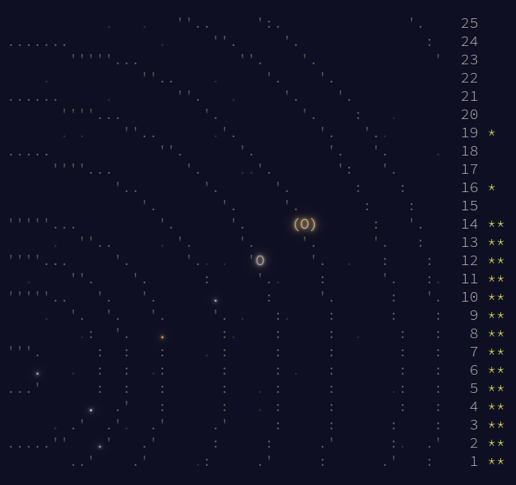

# Advent of Code 2019

Will come back some day..

Its that time of year again! Odds are some technical misfortune will befall the Santa and it will be up to thousands of programmers around the globe to save Christmas.

This year I will once again be solving the problems using C++. I haven't had much occasion to use this language lately so this will be a great opportunity to get back into shape.

My main goal this year is to automate more of my workflow using bash scripts. As with previous years I will attempt to parallelize any solutions that I can.

Some stretch goals include:
* Solve some problems in C
* Create a visualization for a problem
* Vigorously document my work
* Identify a needed library and either use existing or write my own

## Preparation

To establish my workflow and identify automation opportunities I will be revisiting some of the probelms from years past. When this year's event begins on Dec 1st I will transfer any of these old solutions to an 'archive' folder.

## Automation

Here are the currently identified automation opportunities:
* repository push and pull
* new day set up (create file)
* input fetching
* compilation at the project and solution levels
